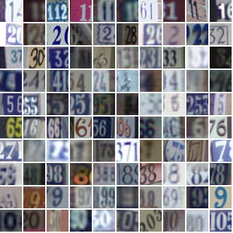

# House-Number-Recognition
Using DCGAN, detect and recognize house number from google street view

## DATA SET 
SVHN is a real-world image dataset for developing machine learning and object recognition algorithms with minimal requirement on data preprocessing and formatting. SVHN is obtained from house numbers in Google Street View images. It's a dataset built-in to the PyTorch datasets library. Download training data from http://ufldl.stanford.edu/housenumbers/train_32x32.mat to data/train_32x32.mat, transform it into Tensor datatypes, then create dataloaders to batch our data into a desired size.

## DCGAN (Deep Convolutional GANs) 
This project is to build a GAN using convolutional layers in the generator and discriminator, called a Deep Convolutional GAN, or DCGAN for short.The DCGAN architecture was first explored in 2016 and has seen impressive results in generating new images.
Training is based on Google's Street View House Numbers (SVHN) dataset.These are color images of house numbers collected from Google street view. SVHN images are in color and much more variable than MNIST.

## Project Goal 
The goal is to create a DCGAN that can generate new, realistic-looking images of house numbers.

* Load in and pre-process the house numbers dataset
* Define discriminator and generator networks
* Train these adversarial networks
* Visualize the loss over time and some sample, generated images

## The Network Model 
Since this dataset is more complex than MNIST data, a deeper network is used to accurately identify patterns in these images and be able to generate new ones, using a series of convolutional or transpose convolutional layers in the discriminator and generator. It's also necessary to use batch normalization to get these convolutional networks to train. A GAN is comprised of two adversarial networks, a discriminator and a generator. The discriminator will alternate training on real and fake (generated) images, and the generator will aim to trick the discriminator into thinking that its generated images are real.

### The Discriminator
* The inputs to the discriminator are 32x32x3 tensor images
* a few convolutional, hidden layers:  kernel_size of 4 and a stride of 2 for strided convolutions
* a fully connected layer for the output(sigmoid output)
* loss function is [BCEWithLogitsLoss](https://pytorch.org/docs/stable/nn.html#bcewithlogitsloss)
* Batch Normalization : [nn.BatchNorm2d](https://pytorch.org/docs/stable/nn.html#batchnorm2d) on each layer

### The Generator 
* The first layer is a fully connected layer which is reshaped into a deep and narrow layer, something like 4x4x512.
* batch normalization and a leaky ReLU activation
* a series of transpose convolutional layers(kernel_size of 4 and a stride of 2 for transpose convolutions)
* batch normalization and ReLU to all but the last of these hidden layers
* output a tanh activation.

## Training
### Discriminator training
1. Compute the discriminator loss on real, training images
2. Generate fake images
3. Compute the discriminator loss on fake, generated images
4. Add up real and fake loss
5. Perform backpropagation + an optimization step to update the discriminator's weights

### Generator training
1. Generate fake images
2. Compute the discriminator loss on fake images, using flipped labels!
3. Perform backpropagation + an optimization step to update the generator's weights

### The Discriminator Loss and The Generator Loss
* For the discriminator, the total loss is the sum of the losses for real and fake images, d_loss = d_real_loss + d_fake_loss.
* the discriminator to output 1 for real images and 0 for fake images
* The generator's goal is to get D(fake_images) = 1. 
* The labels are flipped to represent that the generator is trying to fool the discriminator into thinking that the images it generates (fakes) are real.

## Reference 
* [Unsupervised Representational Learning with DCGAN](https://arxiv.org/pdf/1511.06434.pdf)
* [SVHN Dataset](http://ufldl.stanford.edu/housenumbers/)
* [Training data](http://ufldl.stanford.edu/housenumbers/train_32x32.mat)
* [PyTorch nn](https://pytorch.org/docs/stable/nn.html#sequential)
